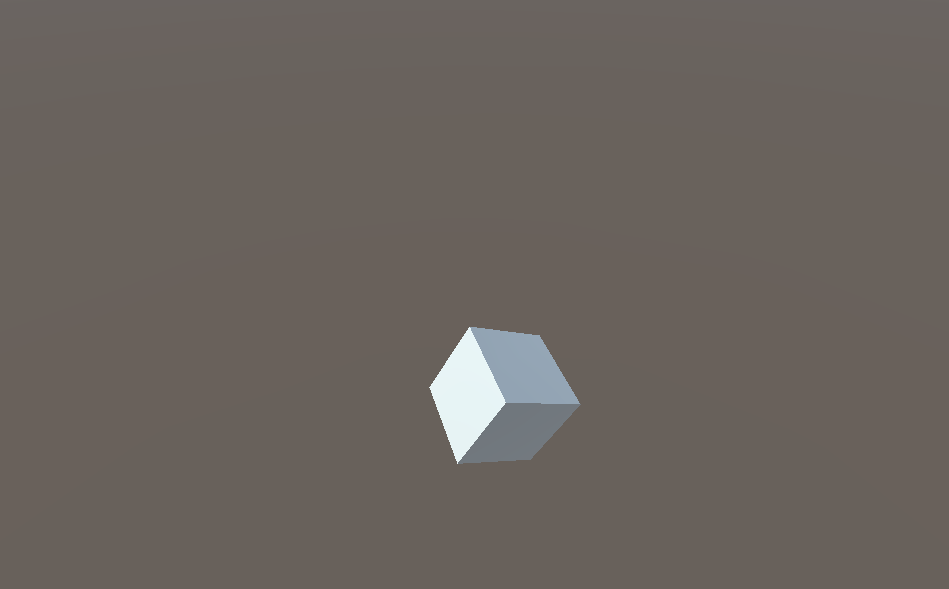

 
  

  &#xa0;

  <!-- <a href="https://modthecubeunity.netlify.app">Demo</a> -->

<h1 align="center">Mod The Cube Unity</h1>

  

  

  

  

  <!--  -->

  <!--  -->

  <!--  -->

<!-- Status -->

<!-- <h4 align="center"> 
	🚧  Mod The Cube Unity 🚀 Under construction...  🚧
</h4> 

 -->

  <a href="#dart-about">About</a> &#xa0; | &#xa0; 
  <a href="#sparkles-features">Features</a> &#xa0; | &#xa0;
  <a href="#rocket-technologies">Technologies</a> &#xa0; | &#xa0;
  <a href="https://github.com/Arthur-Matias" target="_blank">Author</a>

 

## :dart: About ##

A Unity challenge that consisted in modding scene with a cube on it, and then building it for the web with OpenGL.

## :sparkles: Features ##

:heavy_check_mark: Change position on page reload;\
:heavy_check_mark: change colors randomly over time;\
:heavy_check_mark: Change rotation speed (on X, Y and Z axis) on page reload;

## :rocket: Technologies ##

The following tools were used in this project:

- [Unity](https://unity.com/pt)
- [C#](https://docs.microsoft.com/pt-br/dotnet/csharp/)

This project is under license from MIT.

Made with :heart: by <a href="https://github.com/Arthur-Matias" target="_blank">Arthur Matias</a>

&#xa0;

<a href="#top">Back to top</a>
